# 🚀 Enterprise AI Email Automation Flow (Production-Grade)

> This workflow represents a complete end-to-end execution pipeline for an enterprise AI Email Automation platform. Every specialized workflow (Calendar, Tasks, CRM, Support, etc.) returns its result to a central orchestrator, which generates a single, validated response before sending it.

---

# Complete Execution Flow

```mermaid
flowchart TD

%% =====================================================
%% EMAIL INGESTION
%% =====================================================

A[Incoming Email]
    --> B[Webhook / Polling]

B --> C[Email Sync Service]
C --> D[Deduplication]
D --> E[Store Raw Email]

%% =====================================================
%% PARSING
%% =====================================================

E --> F[Parse Email]

F --> G[Headers]
F --> H[Body]
F --> I[Attachments]
F --> J[Thread Detection]
F --> K[Metadata Extraction]

%% =====================================================
%% ATTACHMENTS
%% =====================================================

I --> L[Document Processing]

L --> L1[OCR]
L1 --> L2[Text Extraction]
L2 --> L3[Chunking]
L3 --> L4[Metadata]
L4 --> L5[Embedding]
L5 --> L6[Vector Database]

%% =====================================================
%% AI PREPROCESSING
%% =====================================================

K --> M[Language Detection]
M --> N[Spam Detection]
N --> O[Intent Classification]
O --> P[Urgency Detection]
P --> Q[Sentiment Analysis]
Q --> R[Entity Extraction]
R --> S[PII Detection]
S --> T[Conversation Summary]

%% =====================================================
%% ROUTER
%% =====================================================

T --> U{Workflow Router}

%% =====================================================
%% AGENTS
%% =====================================================

U --> V1[Support Agent]
U --> V2[Sales Agent]
U --> V3[Calendar Agent]
U --> V4[Task Agent]
U --> V5[CRM Agent]
U --> V6[Knowledge Agent]
U --> V7[Personal Assistant]
U --> V8[Custom Workflow]

%% =====================================================
%% SUPPORT
%% =====================================================

V1 --> W1[Retrieve Knowledge]
W1 --> X

%% =====================================================
%% SALES
%% =====================================================

V2 --> W2[Lead Qualification]
W2 --> W3[Pricing Lookup]
W3 --> X

%% =====================================================
%% CALENDAR
%% =====================================================

V3 --> C1[Extract Meeting Details]
C1 --> C2[Check Calendar Availability]

C2 --> C3{Available?}

C3 -->|Yes| C4[Create Calendar Event]

C3 -->|No| C5[Find Available Slots]

C5 --> C6[Suggest New Time]

C4 --> C7[Generate Meeting Link]

C6 --> X
C7 --> X

%% =====================================================
%% TASKS
%% =====================================================

V4 --> T1[Extract Action Items]
T1 --> T2[Priority]
T2 --> T3[Deadline]
T3 --> T4[Create Task]
T4 --> T5[Assign Owner]
T5 --> X

%% =====================================================
%% CRM
%% =====================================================

V5 --> R1[Find Contact]
R1 --> R2[Update CRM]
R2 --> R3[Customer History]
R3 --> X

%% =====================================================
%% KNOWLEDGE
%% =====================================================

V6 --> K1[Generate Search Query]
K1 --> K2[Vector Search]
K2 --> K3[Rerank Results]
K3 --> K4[Build Context]
K4 --> X

%% =====================================================
%% PERSONAL
%% =====================================================

V7 --> P1[Email Drafting]
P1 --> X

%% =====================================================
%% CUSTOM
%% =====================================================

V8 --> CW1[Tenant Workflow]
CW1 --> X

%% =====================================================
%% ORCHESTRATOR
%% =====================================================

X[Workflow Result Aggregator]

X --> Y[Context Builder]

Y --> Z[Prompt Builder]

Z --> Z1[System Prompt]
Z1 --> Z2[Tenant Prompt]
Z2 --> Z3[Conversation History]
Z3 --> Z4[RAG Context]
Z4 --> Z5[Workflow Results]

%% =====================================================
%% LLM
%% =====================================================

Z5 --> AA[LLM Router]

AA --> AB[OpenAI]
AA --> AC[Gemini]
AA --> AD[Claude]
AA --> AE[Local Model]

AB --> AF
AC --> AF
AD --> AF
AE --> AF

%% =====================================================
%% VALIDATION
%% =====================================================

AF[Generated Response]

AF --> AG[Hallucination Check]
AG --> AH[Policy Validation]
AH --> AI[Grammar Check]
AI --> AJ[Tone Validation]
AJ --> AK[PII Validation]
AK --> AL[Confidence Score]

%% =====================================================
%% DECISION
%% =====================================================

AL --> AM{Confidence}

AM -->|High| AN

AM -->|Medium| AO

AM -->|Low| AO

%% =====================================================
%% HUMAN REVIEW
%% =====================================================

AO[Human Approval]

AO --> AP[Reviewer]

AP --> AQ{Approved?}

AQ -->|Yes| AN

AQ -->|Edit| AR[Edit Draft]

AR --> AN

AQ -->|Reject| AS[Archive Draft]

%% =====================================================
%% EMAIL RESPONSE
%% =====================================================

AN[Build Email]

AN --> AT[HTML Template]

AT --> AU[Signature]

AU --> AV[Attach Files]

AV --> AW[Send Email]

%% =====================================================
%% POST PROCESSING
%% =====================================================

AW --> AX[Update Email Thread]

AX --> AY[Store Conversation]

AY --> AZ[Update Calendar]

AZ --> BA[Update CRM]

BA --> BB[Update Tasks]

BB --> BC[Notification Service]

BC --> BD[Audit Log]

BD --> BE[Analytics]

BE --> BF[Learning Pipeline]

BF --> BG[Feedback Dataset]

BG --> BH[Prompt Optimization]

BH --> BI[Knowledge Base Update]

BI --> BJ[Model Evaluation]

BJ --> BK[Completed]
```

---

# Processing Stages

| Stage | Description |
|---------|-------------|
| Email Sync | Receive emails from Gmail, Outlook, IMAP |
| Parsing | Extract headers, body, attachments, metadata |
| AI Processing | Classify, detect language, urgency, sentiment |
| Workflow Router | Decide which specialized agents should run |
| Specialized Agents | Calendar, CRM, Tasks, Support, Sales, etc. |
| Workflow Aggregator | Combine outputs from all executed agents |
| RAG | Retrieve company knowledge |
| Prompt Builder | Merge context into the LLM prompt |
| LLM | Generate a response |
| Validation | Hallucination, policy, grammar, tone, PII checks |
| Decision | Auto-send or human approval |
| Email Delivery | Send final email |
| Post Processing | Update thread, calendar, CRM, tasks |
| Analytics | Track cost, tokens, latency, accuracy |
| Learning | Improve prompts and knowledge base |

---

# Key Design Principles

- Single email enters the system once.
- Multiple agents can execute in parallel.
- Agents **never send emails directly**.
- Every agent returns structured results to the **Workflow Result Aggregator**.
- The LLM generates **one unified response** using all available context.
- Validation always runs before sending.
- Human approval is optional based on confidence or policy.
- After sending, all downstream systems (Calendar, CRM, Tasks, Analytics) are updated.
- User feedback continuously improves prompts and the knowledge base.

---

# Example Execution

**Incoming email:**

> "Hi, can we meet next Tuesday at 3 PM? Also, please send me your enterprise pricing. I've attached our requirements."

**Workflow:**

1. Email received.
2. Attachments processed and indexed.
3. Intent classifier detects:
   - Meeting request
   - Sales inquiry
   - Document attachment
4. Calendar Agent checks availability.
5. Sales Agent retrieves pricing.
6. Knowledge Agent retrieves product documentation.
7. Workflow Aggregator combines:
   - Calendar result
   - Pricing
   - RAG context
8. LLM generates a single reply.
9. Validation passes.
10. Meeting is created.
11. Email confirmation is sent.
12. CRM is updated.
13. Thread is updated.
14. Analytics and learning pipelines record the interaction.

---

# Recommended Microservices

- API Gateway
- Email Sync Service
- Email Parser Service
- Attachment Service
- Document Processing Service
- AI Orchestrator Service
- Workflow Router Service
- Calendar Service
- Task Service
- CRM Service
- RAG Service
- Prompt Service
- LLM Gateway
- Validation Service
- Approval Service
- Email Sender Service
- Notification Service
- Analytics Service
- Audit Service
- Learning Service
- IAM Integration